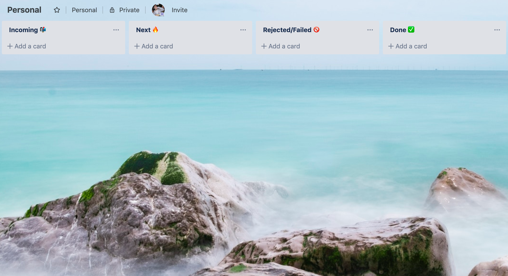

Our day is bombarded with inputs, things to be done and to be done on time: the more our lives become dynamic, the less can we rely on routine to remember what we need to do, so we need to develop new habits for being "productive".

## Defining productivity, measuring productivity

Productivity is the ratio of "completed" things to "supposed to be completed" things, basically the rate at which we complete tasks.

For me personally, being productive means also following up on more "inputs", don't let things that may seem uninportant at first to be left behind.

Part of the quest on being more productive for me wasn't just about completing more actions, but actually generating more of them: that article that I meant to read but I forgot because I didn't save it anywhere, that email that I wanted to follow up on but then forgot, that refund I had to request but got lost in the many other things I had to do. The list goes on and these are all lost opportunities.

## What needs to be done?

Be it business or personal life, to be more productive we need to learn how to handle the inputs that our day throws at us.

_An input is anything that could require something to be done in response._

Following are my main inputs:

- Thoughts (while reading an article/book, an idea to work on 💡)
- Emails (call back the accountant to discuss the latest tax return, complain about that gas bill you just received in your inbox)
- Instant messaging/team messaging (review that article sent by a peer, save the date for the event suggested in the group chat)
- Social media (read the blog posted on that tweet, buy a framed photo posted by my favourite photographer on IG)
- Real world (billboards on the street, paper mail to follow up on)

How to react to those inputs and turn them into actions is the focus of this article.

## Managing actions

I manage all actions (tasks) with [**Trello**](https://trello.com/). Nothing new here.

> Trello’s boards, lists, and cards enable you to organize and prioritize your projects in a fun, flexible, and rewarding way.

Trello is a fantastic tool to handle tasks from their inceptions down to their completion, and it's free.

What can be tricky in Trello is how to organize the board in a way that can help you achieve your goals faster.

After a few rounds of trial and error I came up with a 4-columns layout that serves me very well:

- **Incoming**: Any new task goes here when it first gets created
- **Next**: These are the tasks that I decide to focus on next: they don't have to be done all in one day, but this is what my short term focus
- **Rejected/Failed**: When reviewing the Incoming column I may decide that some actions are not needed after all, or after trying to work on the I may realise that it was a mistake: in that case I'd just drop them into this column
- **Done**: The most satisfactory column: whenever something is done, drag it all the way to the end. This is the reason Done is the last column

If you wanted to keep things even easier, you could combine the last two columns into one: **Rejected || Done** and switch to a 3-columns layout. I've had this for a while and worked great too.

**Rules**:

- to keep things neat, before starting a new week (usually on a Sunday evening) archive all cards in the Rejected and Done columns to have a clean board for the week to come
- tasks that have been in the Next column for a week have a very low chance of getting done: review them before the beginning of a new week and don't be afraid to throw them in Rejected or put them back into Inbox. Your Next column should always reflect your current focus.

### How many boards?

I'm a big fan of keeping things small and simple and I advocate the use of a single board.

The reason is simple: as soon as we start having to focus on more than one board, the chance of missing actions increases. Switching constantly from one to another quickly becomes a burden and in my experience, one or more of the boards become neglected.

My suggestion is to start with one and split into two only when you feel it's strictly necessary.

Use and abuse [labels](https://help.trello.com/article/797-adding-labels-to-cards) and [keyboard shortcuts](https://trello.com/shortcuts) to organise cards: colors are a great way to give you a bird's-eye view of the type of actions you're supposed to work on, making the use of a single board a lot easier.

## Helper tools

### Taking quick notes along the way

There are cases when you think about something and want to jot it down quickly, you don't necessarily need to act on that just yet.

In those scenarios, a notes app is your best friend. For me, a notes app needs to be fast to open and able to sync up across all my devices so I can later review my notes (feel free to use a paper notebook if you'd be so inclined).

I use **Apple Notes** whenever I need to get an idea out of my brain and into my [external brain](http://runrunlive.com/the-power-of-the-external-brain) for later review. [Google Keep](https://www.google.com/keep/) is a viable alternative.  
Be sure to choose an app that can be synced across devices for free (that's why I don't use Evernote) and that's blazing fast to open, so you don't miss the moment.

### Remembering dates and times

Some of your actions will have a specific due date and time: to store time-specific actions I use [**Google Calendar**](https://calendar.google.com).

Whatever app you pick, make sure it's got web, desktop and mobile apps so you can stay on top of your schedule no matter where you are and what's available to you.

### Capturing the moment

A picture is worth a thousand words, and sometime there's no better way to remember something than taking a snap of it.

Better yet, any app you have on your phone will do just fine!

## Creating a flow

The above apps (or better: tools) represent the bulk of my workflow, pretty much all I do ends up in one of them.

It's only when you start making them work together, though, that they start to shine.

### Email to Trello

By far my favourite feature: you can create a card in Trello by forwarding emails to your board.  
Follow [these steps](https://help.trello.com/article/809-creating-cards-by-email) to create an email address for your board and save that address into your email's address book.

Any time you receive an email and you have to follow up on that, forward it to your Trello board and archive it: a new card will be created (in a column that you'll have to specify, I use "Incoming").

### Web to Trello

More often than not, browsing the web results in articles you want to read at a different time, things you want to buy later (yeah you may not want to save those 😁): use the [Trello Bookmarklet](https://trello.com/en-GB/add-card) to create a card from a web page.

### Notes to Trello

Once your thoughts have been defined into a note and you're ready to work on it, it's time to get that note on to the board and act on it.

In Apple Notes (but generally in any other notes app) use the share button and share it to Trello (Trello's app needs to be installed on your device): a card will be created and again, you didn't even have to open Trello.

### Photos to Trello

Once you have your pic saved, use the share feature present on every photo app to share it to Trello: another card created!

### Trello to Google Calendar

There will be tasks with a specific due date: for those kind of actions, you'll probably prefer to see them on your calendar app too, to make sure they are done on time.

No need to add an event in your calendar, duplicating the effort: just set the due date on the Trello card and use [this Power-Up](https://help.trello.com/article/829-using-trello-with-google-calendar) to add the Trello calendar to your GCal: job done!

---

The above tools allow you to create a "flow" of actions from any "source" into your board, where you can organize and act on them. This is the first step to being more productive.

You may need other tools more specific to your needs, but as long as you make them work together in a way that channels your actions into one single place, you'll be able to act on them.

[Zapier](https://zapier.com/) can be of help when it comes to automating workflows, give it a go if you want take automation one step further.

## Creating a habit

Having a nice board that no one use is no help, that's why it's important that you make a habit of having it in front of you every day: let it become integral part of your daily routine.

Only you can act on those actions and you can only do that if you see them in the first place.

Install Trello in every device you take with you, make a habit of keeping a tab open on it in your browser, or check the app on your phone first thing in the morning, as part of your breakfast routine. Keep going back to it during the day to remind yourself of what needs to be done.

Set a daily reminder (or use [Habitify](https://habitify.me/)) if you need to get into the habit, and stick with that every day, come what may: it can take a [couple of months to form a new habit](https://jamesclear.com/new-habit), so stay consistent.

## Conclusions

Being more productive comes down to being more focussed and using the right tools in the simplest way: whatever method you pick, stick with it and be consistent, that's the best way to get results.
